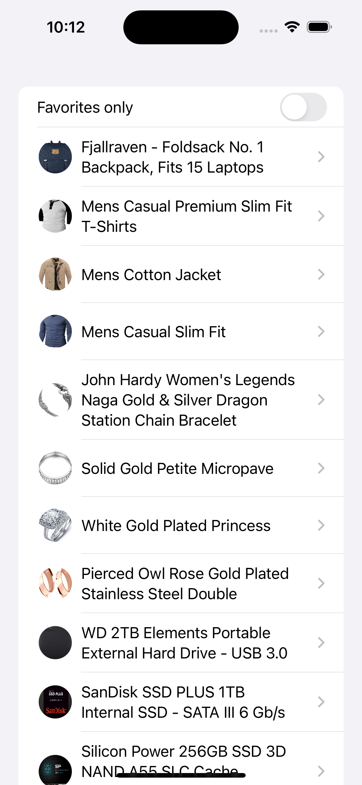

# APIClient-AsyncAwait-SwiftUI
Simple API  Client using URLSession with async/await and SwiftUI 

## NOTE
 * This example use fakestoreapi.com
 * Not all tests are covered
 * Feedback is welcome :) 
